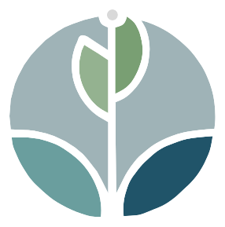

<h1 align="center">PAPC</h1>
<p align="center">
  
</p>

# Introdução

O PAPC(Plataforma de Apoio Psicológico Comunitário) é um projeto final do curso TIC20 de fullstack intemediário ministrado pelo Capacita Brasil em Conjunto com o Atlântico Avanti, nele foi utilizado as tecnologias de Html, Css, JavaScript, React e Bootstrap. Essa é uma implementação inicial do Projeto tendo em vista que em sua continuidade vai ser implementado uma integração com o banco de dados e uma api ou seja alem do Front-End o projeto terá um Back-End. O projeto por enquanto está em andamento porem logo logo terá mais atualizações, contamos com você para vizualizar o nosso resultado final.

# Desafio

Imagine que você mora em uma comunidade onde muitas pessoas enfrentam
dificuldades emocionais e psicológicas. Elas precisam de ajuda, mas esbarram em
dois grandes problemas: o custo elevado de atendimento psicológico e a falta
de acesso a profissionais qualificados. Por outro lado, há muitos profissionais
dispostos a ajudar, mas que não têm uma plataforma para oferecer seus serviços à
comunidade.

# Ideia

Vamos construir uma plataforma digital inclusiva que conecta profissionais de
psicologia com pessoas que precisam de apoio, promovendo acesso a atendimento
psicológico gratuito ou de baixo custo. Nesta plataforma:

- Profissionais podem se cadastrar, oferecer atendimentos gratuitos ou a
  preços acessíveis, e divulgar suas especialidades.
- Pacientes podem buscar por profissionais com filtros como região,
  especialidade e faixa etária, e acessar informações relevantes.
- Um administrador gerencia o sistema, garantindo que tudo funcione de forma
  organizada.

# O Impacto

- Comunidade mais forte: Facilitar o acesso a saúde mental melhora a
  qualidade de vida e promove bem-estar.
- Profissionais engajados: Psicólogos têm uma forma prática de contribuir
  para a sociedade, fortalecendo sua presença na comunidade.
- Sustentabilidade social: Ao oferecer serviços gratuitos e de baixo custo, a
  plataforma equilibra solidariedade com viabilidade.

# React + Vite

Este projeto é um template mínimo para configurar um ambiente React utilizando Vite com HMR (Hot Module Replacement) e algumas regras do ESLint.

## Pré-requisitos

Certifique-se de ter o Node.js instalado na sua máquina. Você pode baixá-lo em [nodejs.org](https://nodejs.org/).

## Instalação

1. Clone o repositório:
   ```sh
   git clone git@github.com:ph3523/PAPC.git
   ```
2. Navegue até o diretório do projeto:
   ```sh
   cd PAPC
   ```
3. Instale as dependências:
   ```sh
   npm install
   ```

## Scripts Disponíveis

No diretório do projeto, você pode executar:

```sh
npm run dev
```

Executa o aplicativo no modo de desenvolvimento.
Abra http://localhost:5173/ para visualizá-lo no navegador

A página será recarregada quando você fizer alterações.
Você também verá quaisquer erros de lint no console.

```sh
npm run build
```

Compila o aplicativo para produção na pasta `dist`.
Ele corretamente empacota o React no modo de produção e otimiza a construção para o melhor desempenho.

```sh
npm run preview
```

Pré-visualiza a compilação de produção localmente.

```sh
npm run lint
```

Executa o ESLint para verificar problemas no código.

## Plugins Oficiais

Atualmente, dois plugins oficiais estão disponíveis:

- [@vitejs/plugin-react](https://github.com/vitejs/vite-plugin-react/blob/main/packages/plugin-react/README.md) uses [Babel](https://babeljs.io/) for Fast Refresh
- [@vitejs/plugin-react-swc](https://github.com/vitejs/vite-plugin-react-swc) uses [SWC](https://swc.rs/) for Fast Refresh

## Estrutura do Projeto

```
public/
  assets/
    img_gp1.jpg
    img_gp2.jpg
    img_gp3.jpg
    img_gp4.jpg
    img_gp5.jpg
    img_gp6.jpg
    logo.svg
src/
  assets/
  components/
    Apoio.css
    Apoio.jsx
    cadastro.css
    cadastro.jsx
    depoimento.css
    depoimento.jsx
    footer.css
    footer.jsx
    header.css
    header.jsx
    login.css
    login.jsx
  data/
    depoimentos.json
    indication.json
  pages/
    styles/
      Home.css
    Home.jsx
  App.css
  App.jsx
  index.css
  main.jsx
.gitignore
eslint.config.js
index.html
package-lock.json
package.json
README.md
vite.config.js
```

## Responsabilidades da Equipe 1

- Pedro Barroso: Estruturação do Projeto, Criação do documento principal, criação dos componentes Apoio e Header bem como suas logicas, elaboração do README e elaboração da Logo
- Marcelo Cardoso
- José Elias: Criação do componente Depoimentos e inserção do mesmo na tela de home, fazendo os ajustes necessários no css;
- Kelwin Gabriel: Realização da criação da tela de Login, fazendo toda logística necessária e ajustes visuais com uso do css.
- Wesley Franklin: Realizada a implementação do cadastro e do footer, abordando tanto a estrutura visual quanto a lógica necessária para seu funcionamento adequado.

## Colaboradores

<table>
  <tr>
    <td align="center"><a href="https://github.com/ph3523"><br /><sub><b>Pedro Barroso</b></sub></a><br /><a href="mailto:ph.barroso3523@gmail.com" title="Email">✉️</a></td>
    <td align="center"><a href="https://github.com/EldFranklin"><br /><sub><b>Wesley Franklin</b></sub></a><br /><a href="mailto:wesleyfranklin@alu.ufc.br" title="Email">✉️</a></td>
    <td align="center"><a href="https://github.com/Eliasfr01"><br /><sub><b>Jose Elias</b></sub></a><br /><a href="mailto:" title="Email">✉️</a></td>
    <td align="center"><a href="https://github.com/pedrohenriqux"><br /><sub><b>Kelwin Gabriel</b></sub></a><br /><a href="mailto:" title="Email">✉️</a></td>
    <td align="center"><a href="https://github.com/Computerkeys"><br /><sub><b>Marcelo Cardoso</b></sub></a><br /><a href="mailto:" title="Email">✉️</a></td>
    
  </tr>
 
</table>
